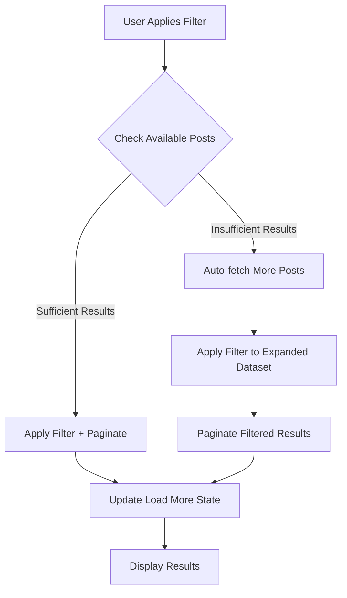

# Design Document

## Overview

This design addresses the Load More button integration issues with search and filters on the dashboard by implementing a unified pagination system that seamlessly handles multiple interaction modes. The solution provides consistent behavior across filtered, searched, and unfiltered content while maintaining optimal performance and user experience.

The core challenge is managing two different pagination strategies:

1. **Server-side pagination** for unfiltered content (fetching from database)
2. **Client-side pagination** for filtered/searched content (slicing loaded data)

The design ensures smooth transitions between these modes and handles edge cases like insufficient filtered results through intelligent data fetching.

## Architecture

### State Management Architecture

```typescript
interface PaginationState {
  // Core pagination state
  currentPage: number;
  hasMorePosts: boolean;
  isLoadingMore: boolean;

  // Data management
  allPosts: Post[]; // All loaded posts from server
  displayPosts: Post[]; // Filtered/searched posts
  paginatedPosts: Post[]; // Currently visible posts

  // Context tracking
  isSearchActive: boolean;
  hasFiltersApplied: boolean;
  totalPostsCount: number; // Total available on server

  // Filter state
  filters: FilterOptions;
  searchResults: SearchResults;
  currentSearchFilters: SearchFilters;
}
```

### Pagination Mode Detection

The system operates in three distinct modes:

1. **Unfiltered Mode**: No search terms or filters applied

   - Uses server-side pagination
   - Fetches 15 posts per Load More request
   - Tracks total available posts from server

2. **Filtered Mode**: Filters applied but no search

   - Uses client-side pagination on loaded posts
   - Auto-fetches more data if insufficient results
   - Paginates through filtered results

3. **Search Mode**: Search terms with optional filters
   - Uses search API results
   - Client-side pagination through search results
   - Combined search + filter logic

### Smart Data Fetching Strategy



## Components and Interfaces

### Enhanced Dashboard Component

```typescript
interface DashboardState {
  // Pagination management
  paginationMode: "server" | "client";
  loadMoreStrategy: "fetch" | "slice";

  // Performance tracking
  lastFetchTime: number;
  fetchInProgress: boolean;
  autoFetchTriggered: boolean;
}

interface LoadMoreConfig {
  postsPerPage: number;
  minResultsForFilter: number;
  maxAutoFetchPosts: number;
  fetchTimeout: number;
}
```

### Unified Load More Handler

```typescript
interface LoadMoreHandler {
  handleLoadMore(): Promise<void>;
  determineStrategy(): "server-fetch" | "client-paginate";
  validateState(): boolean;
  updatePaginationState(newPosts?: Post[]): void;
}
```

### Filter Integration Interface

```typescript
interface FilterIntegration {
  applyFiltersAndSearch(): void;
  resetPagination(): void;
  shouldAutoFetch(filteredResults: Post[]): boolean;
  fetchAdditionalPosts(targetCount: number): Promise<Post[]>;
}
```

## Data Models

### Enhanced Post Model

```typescript
interface Post {
  id: string;
  content: string;
  post_type: "text" | "audio";
  created_at: string;
  user_id: string;
  audio_url?: string;
  audio_filename?: string;

  // Enhanced interaction data
  like_count: number;
  liked_by_user: boolean;
  user_profiles: UserProfile;

  // Pagination metadata
  fetch_batch?: number; // Which batch this post was loaded in
  filter_matched?: boolean; // Whether this post matches current filters
}
```

### Pagination Metadata

```typescript
interface PaginationMetadata {
  totalServerPosts: number;
  loadedServerPosts: number;
  currentBatch: number;
  lastFetchTimestamp: number;

  // Filter-specific metadata
  totalFilteredPosts: number;
  visibleFilteredPosts: number;
  filterAppliedAt: number;
}
```

### Load More State Machine

```typescript
type LoadMoreState =
  | "idle"
  | "loading-server"
  | "loading-client"
  | "auto-fetching"
  | "complete"
  | "error";

interface LoadMoreStateMachine {
  currentState: LoadMoreState;
  canTransition(to: LoadMoreState): boolean;
  transition(to: LoadMoreState, context?: any): void;
}
```

## Error Handling

### Comprehensive Error Management

```typescript
interface ErrorHandling {
  // Network errors
  handleNetworkError(error: Error): void;
  retryWithBackoff(operation: () => Promise<any>): Promise<any>;

  // State consistency errors
  validateStateConsistency(): boolean;
  recoverFromInconsistentState(): void;

  // Race condition prevention
  preventConcurrentRequests(): boolean;
  cancelPendingRequests(): void;
}
```

### Error Recovery Strategies

1. **Network Failures**: Exponential backoff retry with user feedback
2. **State Inconsistencies**: Automatic state reset with data refetch
3. **Race Conditions**: Request queuing and cancellation
4. **Memory Issues**: Cleanup strategies for long browsing sessions

### Graceful Degradation

```typescript
interface GracefulDegradation {
  // Fallback behaviors
  fallbackToBasicPagination(): void;
  disableAdvancedFeatures(): void;

  // User communication
  showErrorMessage(type: ErrorType): void;
  provideRetryOptions(): void;
}
```

## Testing Strategy

### Unit Testing Approach

1. **Pagination Logic Tests**

   ```typescript
   describe("Load More Pagination", () => {
     test("should handle server-side pagination correctly");
     test("should handle client-side pagination correctly");
     test("should transition between pagination modes");
     test("should prevent duplicate requests");
   });
   ```

2. **Filter Integration Tests**

   ```typescript
   describe("Filter Integration", () => {
     test("should apply filters to all loaded posts");
     test("should auto-fetch when insufficient results");
     test("should reset pagination on filter changes");
   });
   ```

3. **State Management Tests**
   ```typescript
   describe("State Management", () => {
     test("should maintain consistent state during transitions");
     test("should handle concurrent state updates");
     test("should recover from error states");
   });
   ```

### Integration Testing Strategy

1. **User Journey Tests**

   - Load dashboard → Apply filter → Load more → Clear filter
   - Search → Apply filter → Load more → Change search
   - Load more multiple times → Apply filter → Continue loading

2. **Performance Tests**

   - Memory usage during extended browsing
   - Response times for different pagination modes
   - Network request optimization validation

3. **Error Scenario Tests**
   - Network failures during Load More
   - Concurrent user interactions
   - Edge cases (empty results, API timeouts)

### End-to-End Testing

```typescript
describe("Dashboard Load More E2E", () => {
  test("Complete user journey with all interaction modes");
  test("Performance benchmarks under realistic usage");
  test("Cross-browser compatibility validation");
  test("Mobile responsiveness and touch interactions");
});
```

## Performance Optimizations

### Memory Management

```typescript
interface MemoryOptimization {
  // Post cleanup strategies
  cleanupOldPosts(threshold: number): void;
  optimizePostData(): void;

  // Cache management
  manageCacheSize(): void;
  clearUnusedCache(): void;
}
```

### Network Optimization

1. **Request Batching**: Combine multiple small requests when possible
2. **Intelligent Prefetching**: Predict user needs based on behavior
3. **Response Caching**: Cache search and filter results appropriately
4. **Request Deduplication**: Prevent duplicate API calls

### Rendering Optimization

```typescript
interface RenderingOptimization {
  // Virtual scrolling for large datasets
  implementVirtualScrolling(): void;

  // Component memoization
  memoizeExpensiveComponents(): void;

  // Lazy loading
  lazyLoadNonCriticalData(): void;
}
```

## Implementation Phases

### Phase 1: Core Pagination Unification

- Implement unified Load More handler
- Create pagination mode detection
- Establish state management patterns
- Add comprehensive logging

### Phase 2: Filter Integration Enhancement

- Implement smart auto-fetching
- Create seamless mode transitions
- Add filter state synchronization
- Enhance error handling

### Phase 3: Search Integration

- Integrate search with unified pagination
- Implement combined search + filter logic
- Add search result caching
- Optimize search performance

### Phase 4: Performance & Polish

- Implement memory management
- Add performance monitoring
- Create comprehensive testing suite
- Add user feedback improvements

## Monitoring and Observability

### Performance Metrics

```typescript
interface PerformanceMetrics {
  // Load More performance
  loadMoreResponseTime: number;
  serverFetchTime: number;
  clientPaginationTime: number;

  // Memory usage
  totalPostsLoaded: number;
  memoryUsage: number;
  cacheSize: number;

  // User experience
  errorRate: number;
  retryAttempts: number;
  userSatisfactionScore: number;
}
```

### Debug Information

```typescript
interface DebugInfo {
  currentMode: "server" | "client";
  stateSnapshot: PaginationState;
  recentActions: UserAction[];
  performanceTimings: PerformanceMetrics;
}
```

This design provides a robust foundation for fixing all Load More integration issues while maintaining excellent performance and user experience. The unified approach ensures consistent behavior across all interaction modes while providing the flexibility to handle edge cases and optimize for different usage patterns.
