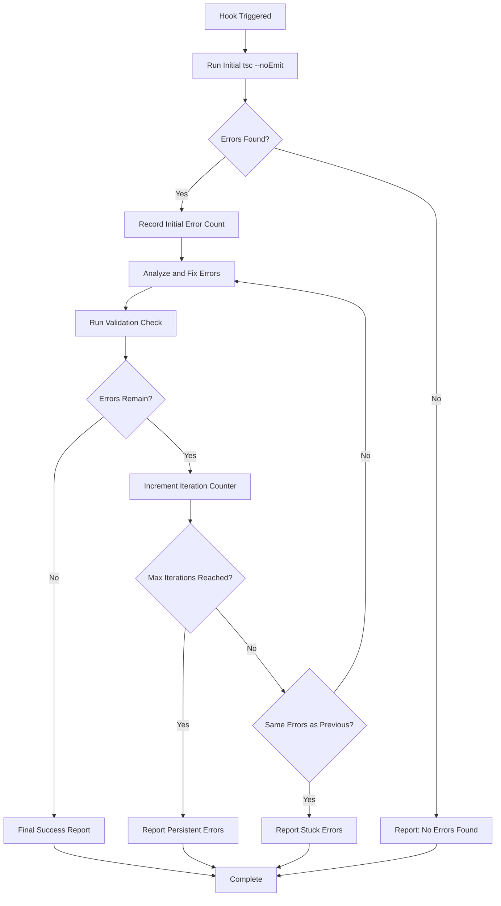

# Design Document

## Overview

The enhanced TypeScript error checker hook will implement a robust validation loop that ensures complete error resolution before reporting success. The design focuses on comprehensive error detection, iterative fixing with progress tracking, and safety mechanisms to prevent infinite loops while maintaining backward compatibility with existing workflows.

## Architecture

### Hook Enhancement Strategy

The enhancement will modify the existing hook prompt to implement a multi-phase validation approach:

1. **Initial Error Detection Phase**: Comprehensive TypeScript compilation check
2. **Iterative Fix Phase**: Apply fixes and re-validate until no errors remain
3. **Final Validation Phase**: Double-check confirmation with detailed reporting
4. **Safety Mechanisms**: Loop prevention and error persistence detection

### Validation Loop Design



## Components and Interfaces

### Enhanced Hook Configuration

The hook will maintain the same trigger conditions but with an enhanced prompt structure:

```json
{
  "enabled": true,
  "name": "Enhanced TypeScript Error Checker",
  "description": "Comprehensive TypeScript error detection with validation loop",
  "version": "3",
  "when": {
    "type": "multiple",
    "conditions": [
      {
        "type": "fileEdited",
        "patterns": ["**/*.ts", "**/*.tsx"]
      },
      {
        "type": "taskCompleted", 
        "patterns": ["**/*"]
      },
      {
        "type": "manual",
        "buttonText": "Check TypeScript Errors"
      }
    ]
  },
  "then": {
    "type": "askAgent",
    "prompt": "[Enhanced multi-phase validation prompt]"
  }
}
```

### Validation Process Components

#### Phase 1: Initial Error Detection
- Execute `npx tsc --noEmit` in client directory
- Parse and count total errors
- Categorize error types (syntax, type, import, etc.)
- Report initial state before fixes

#### Phase 2: Iterative Error Resolution
- Apply targeted fixes for each error category
- Track fixes applied with file locations
- Implement iteration counter for safety
- Store previous error signatures for comparison

#### Phase 3: Final Validation
- Execute final `npx tsc --noEmit` check
- Confirm zero errors with explicit validation
- Generate comprehensive completion report
- Document all fixes applied during the session

### Safety Mechanisms

#### Loop Prevention System
- **Maximum Iterations**: Limit to 5 fix-validate cycles
- **Error Persistence Detection**: Compare error signatures between iterations
- **Stuck Error Reporting**: Identify errors that persist across multiple fix attempts
- **Graceful Termination**: Provide clear reporting when manual intervention is needed

#### Error Classification System
- **Fixable Errors**: Type annotations, imports, syntax issues
- **Complex Errors**: Require architectural changes or manual review
- **Infrastructure Errors**: TypeScript compiler or configuration issues

## Data Models

### Error Tracking Structure
```typescript
interface ErrorSession {
  initialErrorCount: number;
  currentIteration: number;
  maxIterations: number;
  fixesApplied: Fix[];
  errorHistory: ErrorSnapshot[];
  persistentErrors: TypeScriptError[];
}

interface Fix {
  file: string;
  line: number;
  errorType: string;
  description: string;
  appliedAt: Date;
}

interface ErrorSnapshot {
  iteration: number;
  errorCount: number;
  errorSignatures: string[];
  timestamp: Date;
}
```

### Reporting Data Model
```typescript
interface ValidationReport {
  success: boolean;
  initialErrors: number;
  finalErrors: number;
  iterationsRequired: number;
  fixesApplied: Fix[];
  persistentErrors?: TypeScriptError[];
  completionMessage: string;
}
```

## Error Handling

### Error Categories and Responses

#### Compilation Errors
- **Type Mismatches**: Automatic type annotation fixes
- **Missing Imports**: Auto-import resolution
- **Syntax Errors**: Code structure corrections
- **Configuration Issues**: TypeScript config validation

#### Infrastructure Errors
- **Compiler Failure**: Report system-level issues
- **File Access Issues**: Permission and path validation
- **Configuration Problems**: tsconfig.json validation

#### Persistent Error Handling
- **Stuck Errors**: Report errors that persist after multiple fix attempts
- **Complex Architectural Issues**: Flag for manual review
- **External Dependency Issues**: Identify third-party type problems

### Graceful Degradation
- Provide partial success reporting when some errors are fixed
- Clear documentation of remaining issues requiring manual intervention
- Maintain hook functionality even when complete automation isn't possible

## Testing Strategy

### Validation Testing Scenarios

#### Happy Path Testing
1. **No Errors Scenario**: Hook reports clean state immediately
2. **Simple Errors**: Single iteration fixes all issues
3. **Multiple Iterations**: Complex errors resolved over several cycles
4. **Complete Success**: All errors resolved with comprehensive reporting

#### Error Handling Testing
1. **Persistent Errors**: Errors that cannot be automatically fixed
2. **Infinite Loop Prevention**: Safety mechanisms activate correctly
3. **Compiler Failure**: Infrastructure issues handled gracefully
4. **Mixed Results**: Some errors fixed, others require manual intervention

#### Integration Testing
1. **File Edit Triggers**: Hook activates correctly on TypeScript file changes
2. **Task Completion Triggers**: Hook runs after task completion
3. **Manual Triggers**: Button functionality works as expected
4. **Backward Compatibility**: Existing workflows continue to function

### Performance Testing
- Validate hook performance with large codebases
- Ensure reasonable execution times for validation cycles
- Test memory usage during iterative error fixing
- Verify hook doesn't impact development workflow speed

## Implementation Considerations

### Prompt Engineering Strategy
The enhanced prompt will use structured instructions to ensure consistent behavior:
- Clear phase separation with explicit validation steps
- Detailed error reporting requirements
- Safety mechanism activation conditions
- Success criteria definition

### Backward Compatibility
- Maintain existing trigger conditions
- Preserve manual button functionality
- Keep error reporting format consistent
- Ensure no breaking changes to development workflow

### Performance Optimization
- Efficient error parsing and categorization
- Minimal redundant TypeScript compiler executions
- Smart iteration limits based on error complexity
- Quick termination for infrastructure issues

### User Experience Enhancement
- Clear progress reporting during multi-iteration fixes
- Detailed success messages with fix summaries
- Helpful error messages for manual intervention cases
- Consistent formatting for easy readability